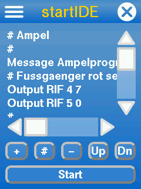
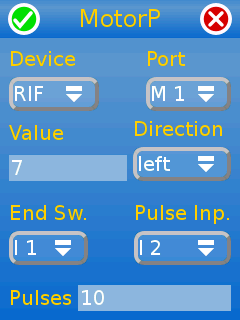

# startIDE

Eine Demo auf YouTube... [so einfach geht es!](https://www.youtube.com/watch?v=IHZensWPgkA)

#### Kurzzusammenfassung in Deutsch:
startIDE ist eine App zum Programmieren von Modellen auf dem fischertechnik TXT Controller mit [community firmware](http://cfw.ftcommunity.de/) oder dem [TX-Pi](https://github.com/harbaum/tx-pi). Die App selbst ist in Deutsch, Englisch oder Französisch lokalisiert, das Handbuch liegt nur in einer deutschen Fassung vor. Neben dem TXT können alle Interfaces der Robo Interface Familie sowie der [ftDuino](https://harbaum.github.io/ftduino/www/de/) angesteuert werden.
Weitere Infos in den unten genannten Threads im ftcommunity Forum.

#### English:
An app for the [ftcommunity firmware](http://cfw.ftcommunity.de/) on TXT controller or [TX-Pi](https://github.com/harbaum/tx-pi) to provide an onboard IDE to control a wide variety of different models ranging from a hands dryer to an industry robot and even beyond, using TXT, TX-Pi, [ftDuino](https://harbaum.github.io/ftduino/www/de/) and the Robo Interface family including Robo LT.

----------------------------
See the ftcommunity board threads:

[The general startIDE thread](https://forum.ftcommunity.de/viewtopic.php?f=33&t=4588)

[Practical experiments using startIDE](https://forum.ftcommunity.de/viewtopic.php?f=8&t=4740)

----------------------------

startIDE can be run on both ft TXT and community TX-Pi.

Some functionality is implemented: Robo family interfaces (Robo Interface, Robo I/O Extention, Robo LT controller and RF Data link) can be connected.
Digital Inputs can be evaluated on both TXT and Robo device, also Outputs and Motors can be accessed.

Encoder Motors connected to TXT also can be controlled (speed, direction and running distance (encoder steps))

Although it is pysically possible to connect more than one interface of the same type, startIDE will only address the first IF found.

When run on ft TXT controller, it is possible to use TXT and a connected Robo family device and a ftDuino*) in parallel.
Running startIDE on the TX-Pi allows for having Robo family device and ftDuino connected in parallel.

A german user guide (Handbuch) is available: [ddoc/Manual_160_de.pdf](ddoc/Manual_160_de.pdf)

See [ddoc/ReferenceSheet](ddoc/ReferenceSheet.pdf) for a list of functions implemented.

*) to use the ftDuino as an I/O module, it must be flashed with the ftduino_direct sketch, available [here](https://github.com/PeterDHabermehl/ftduino_direct) or directly within the flash app [ftDuinIO](https://github.com/PeterDHabermehl/ftDuinIO)
